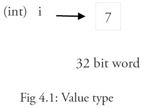
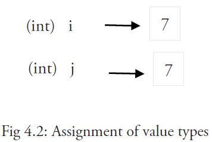
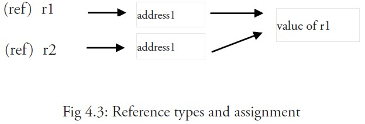

> @Date    : 2021-01-17 20:06:16
>
> @Author  : Lewis Tian (taseikyo@gmail.com)
>
> @Link    : github.com/taseikyo

# Go 语言变量

[README](README.md) | [Go 语言数据类型](02.go-data-types.md) | [Go 语言常量](04.go-constants.md)

## Table of Contents

- [变量声明](#变量声明)
	- [1. 指定类型](#1-指定类型)
	- [2. 自动推断类型](#2-自动推断类型)
	- [3. 海象运算符](#3-海象运算符)
	- [多变量声明](#多变量声明)
- [值类型和引用类型](#值类型和引用类型)
- [海象运算符](#海象运算符)

Go 语言变量名由字母、数字、下划线组成，其中首个字符不能为数字。

## 变量声明

### 1. 指定类型

指定变量类型，如果没有初始化，则变量默认为零值

```Golang
var v_name v_type
v_name = val
```

```Golang
package main
import "fmt"
func main() {

    // 声明一个变量并初始化
    var a = "RUNOOB"
    fmt.Println(a)

    // 没有初始化就为零值
    var b int
    fmt.Println(b)

    // bool 零值为 false
    var c bool
    fmt.Println(c)
}
// RUNOOB
// 0
// false
```

- 数值类型（包括complex64/128）为 `0`
- 布尔类型为 `false`
- 字符串为 ""（空字符串）
- 以下几种类型为 `nil`：
	- `var a *int`
	- `var a []int`
	- `var a map[string] int`
	- `var a chan int`
	- `var a func(string) int`
	- `var a error // error 是接口`

```Golang
package main

import "fmt"

func main() {
    var i int
    var f float64
    var b bool
    var s string
    fmt.Printf("%v %v %v %q\n", i, f, b, s)
}
// 0 0 false ""
```

### 2. 自动推断类型

根据值自行判定变量类型

```Golang
var v_name = value
```

```Golang
package main

import "fmt"

func main() {
    var d = true
    fmt.Println(d)
}
// true
```

### 3. 海象运算符

注意：`:=` 左侧如果没有声明新的变量，就产生编译错误

```Golang
v_name := value
```

```Golang
var intVal int 

intVal :=1 // 这时候会产生编译错误

intVal,intVal1 := 1,2 // 此时不会产生编译错误，因为有声明新的变量，因为 := 是一个声明语句
```

### 多变量声明

```Golang
//类型相同多个变量, 非全局变量
var vname1, vname2, vname3 type
vname1, vname2, vname3 = v1, v2, v3

var vname1, vname2, vname3 = v1, v2, v3 // 不需要显示声明类型，自动推断

vname1, vname2, vname3 := v1, v2, v3 // 出现在 := 左侧的变量不应该是已经被声明过的，否则会导致编译错误


// 这种因式分解关键字的写法一般用于声明全局变量
var (
    vname1 v_type1
    vname2 v_type2
)
```

## 值类型和引用类型

所有像 int、float、bool 和 string 这些基本类型都属于**值类型**，使用这些类型的变量直接指向存在内存中的值：



当使用等号 = 将一个变量的值赋值给另一个变量时，如：j = i，实际上是在内存中将 i 的值进行了拷贝：



你可以通过 `&i` 来获取变量 i 的内存地址

更复杂的数据通常会需要使用多个字，这些数据一般使用引用类型保存。

一个引用类型的变量 r1 存储的是 r1 的值所在的内存地址（数字），或内存地址中第一个字所在的位置。



这个内存地址称之为指针，这个指针实际上也被存在另外的某一个值中。

同一个引用类型的指针指向的多个字可以是在连续的内存地址中（内存布局是连续的），这也是计算效率最高的一种存储形式；也可以将这些字分散存放在内存中，每个字都指示了下一个字所在的内存地址。

当使用赋值语句 r2 = r1 时，只有引用（地址）被复制。

如果 r1 的值被改变了，那么这个值的所有引用都会指向被修改后的内容，在这个例子中，r2 也会受到影响。

## 海象运算符

`a := 50` 是使用变量的首选形式，但是它只能被用在函数体内，而**不可以用于全局变量的声明与赋值**
