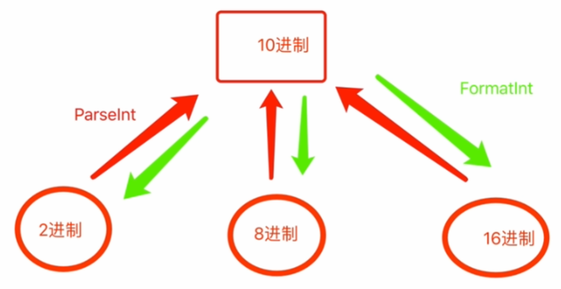

> @Date    : 2021-05-10 21:13:05
>
> @Author  : Lewis Tian (taseikyo@gmail.com)
>
> @Link    : github.com/taseikyo

# day05 数据类型

-[toc]

数据类型，其实就是各种各样类型的数据。

Go语言中常见的数据类型有挺多，例如：


- 整型，用于表示整数
- 浮点型，用于表示小数
- 布尔型，用于表示真/假
- 字符串，用于表示文本信息
- 数组，用于表示多个数据（数据集合）
- 指针，用于表示内存地址的类型
- 切片，用于表示多个数据（数据集合）
- 字典，用于表示键值对结合
- 结构体，用于自定义一些数据集合
- 接口，用于约束和泛指数据类型

## 1.整型

Go中的整型分为有符号和无符号两大类，有符号的包含负值，无符号不包含负值。

有符号整型：

- int8（-128->127）
- int16（-32768->32767）
- int32（-2,147,483,648->2,147,483,647）
- int64（-9,223,372,036,854,775,808->9,.223,372,036,854,775,807）
- int
    - 在32位操作系统上使用32位（-2,147,483,648->2,147,483,647）
    - 在64位操作系统上使用64位（-9,223,372,036,854,775,808->9,223,372,036,854,775,80）

无符号整数：

- uint8（0->255）
- uint16（0->65,535）
- uint32（0->4,294,967,295）
- uint64（0->18,446,744,073,709,551,615）
- uint
    - 在32位操作系统上使用32位（0->4,.294,967,295）
    - 64位操作系统上使用64位（0->18,446,744,073,709,551,615）

不同整型可表示的数据范围不同，我们需要根据自己的需求来选择适合的类型。

### 1.1 整型之间的转换

```Golang
data := intXXX(v)
```

```Golang
var v1 int8 = 10
var v2 int16 = 10

v3 := int16(v1) + v2
```

注意：

- 地位转向高位，没问题。
- 高位转向低位，有问题

### 1.2 整型与字符串的转换

```Golang
v1 := 19
result := strconv.Itoa(v1)
fmt.Println(result, reflect.TypeOf(result))

var v2 int8 = 17
data := strconv.Itoa(int(v2))
fmt.Println(data)
```

符串转换为整型：转换后是 int 类型

```Golang
v1 := "SB"
result, err := strconv.Atoi(v1)
fmt.Println(result, err)
```

### 1.3 进制转换

- Go代码中
    - 十进制，整型的方式存在
    - 其他进制，是以字符串的形式存在
- 整型，十进制数

十进制转换为二进制、八进制、十六进制：

```Golang
v1 := 99

// 整型（十进制）转换为二进制、八进制、十六进制

// 第二个参数就是 base
r1 := strconv.FormatInt(int64(v1), 16)
fmt.Println(r1, reflect.TypeOf(r1)) // 63 string
```

其他进制转换为十进制：

```golang
data := "10101001"

// data，要转换的文本
// 2，把文本仿作二进制转换成十进制（整型）
// 16，转换过程中对结果进行约束（可能溢出 -> err）
// 结果：结果永远是 int64 类型
r1, err := strconv.ParseInt(data, 2, 16)
fmt.Println(r1, reflect.TypeOf(r1))
```

提醒：通过 ParseInt 将字符串转换为 10 进制时，本质上是与 Atoi 相同的



```Golang
//-将十进制14用转换成16进制的字符串。
V1 := strconv.FormatInt(14, 16)
fmt.Println(v1)

//-将2进制“10011"转换成10进制的整型。
v2, _ := strconv.ParseInt("10011", 2, 0)
fmt.Println(v2)

//-将2进制“10010”转换成16进制的字符串。
V3, _ := strconv.ParseInt("10011", 2, 0)
v4 := strconv.FormatInt(v3, 16)
fmt.Printin(v4)
```

### 1.4 常见数学运算

### 1.5 指针/nil/声明变量/new
